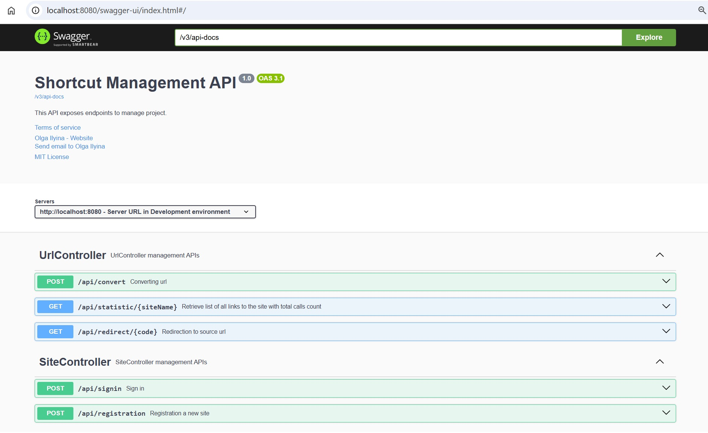
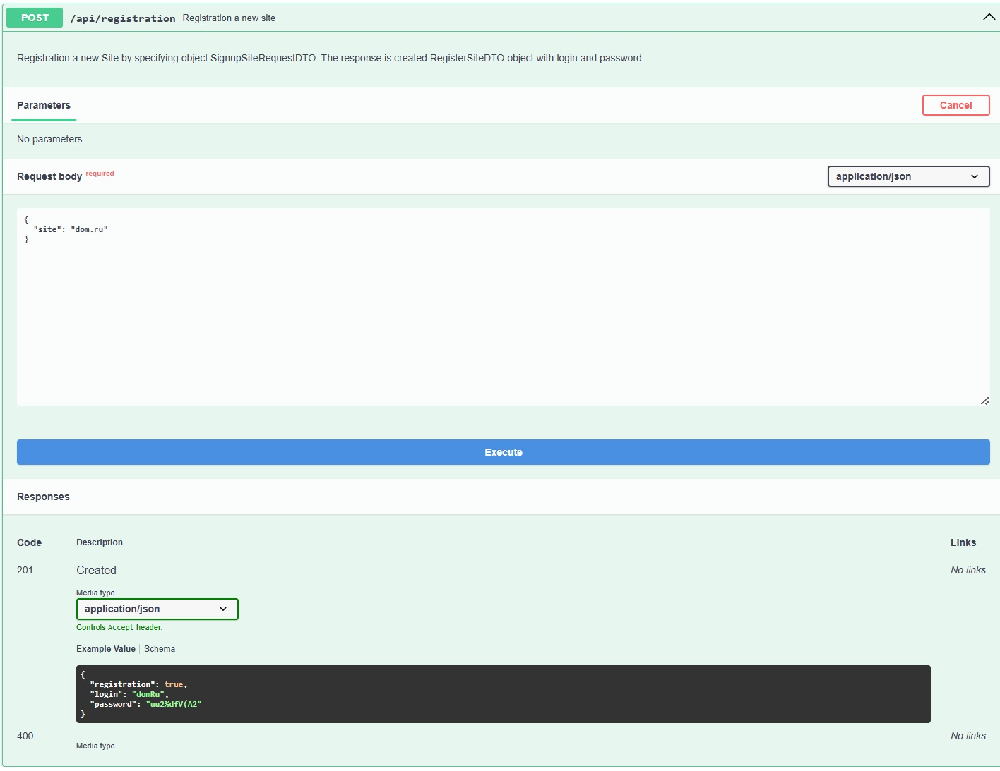
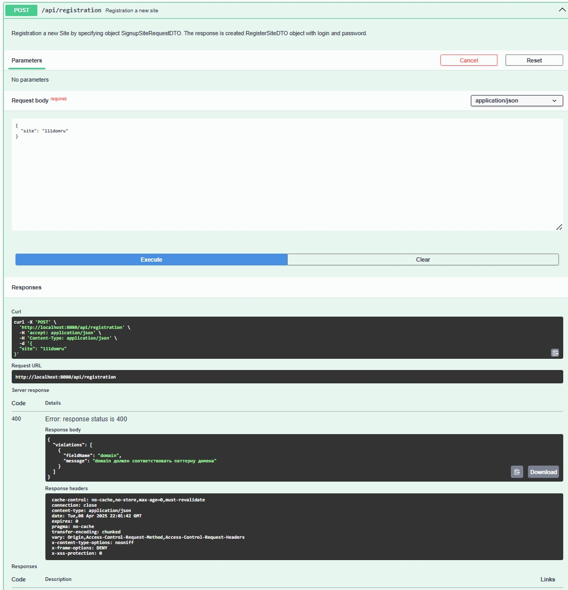
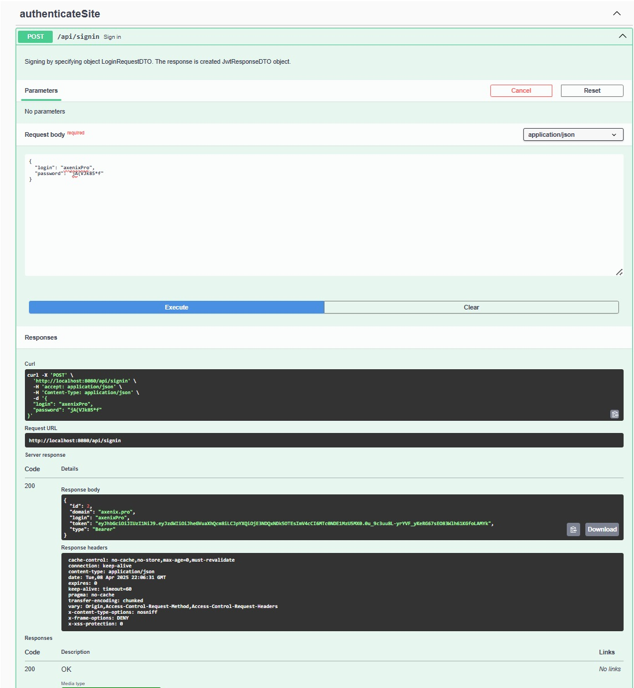
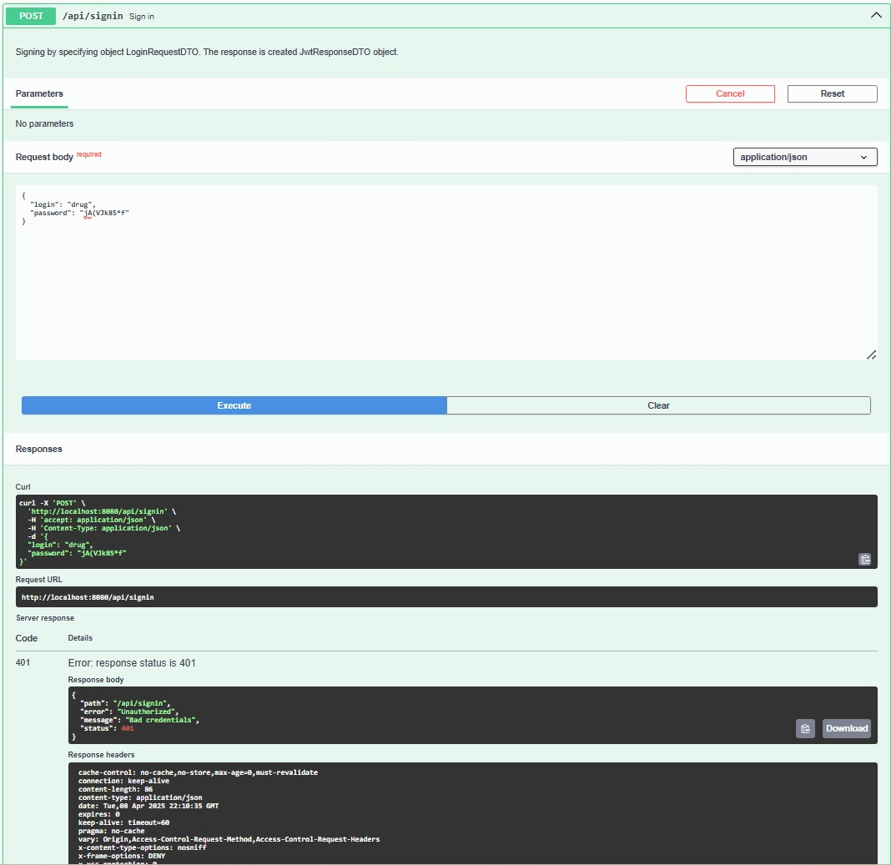
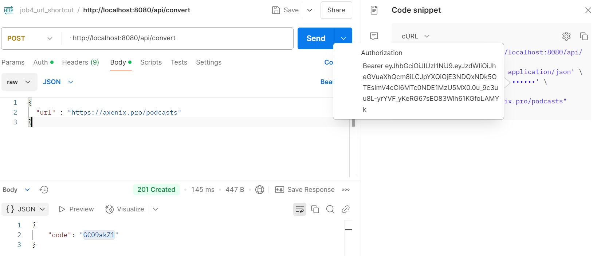
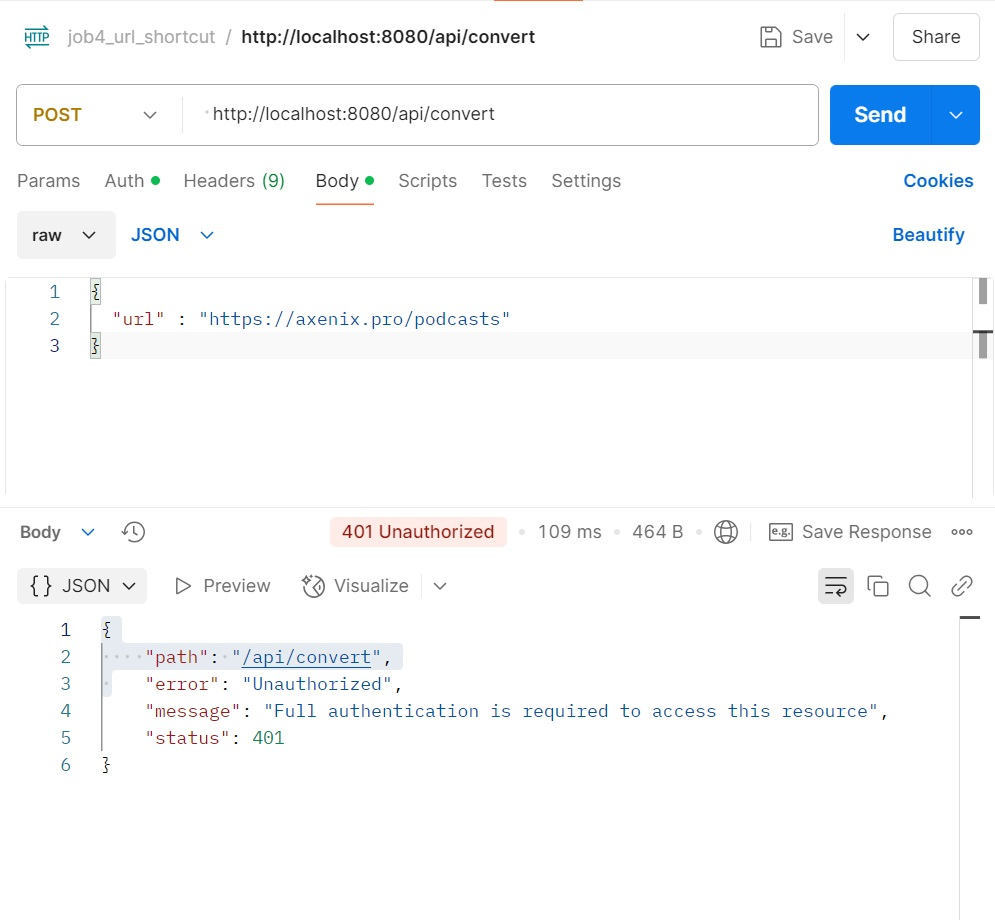
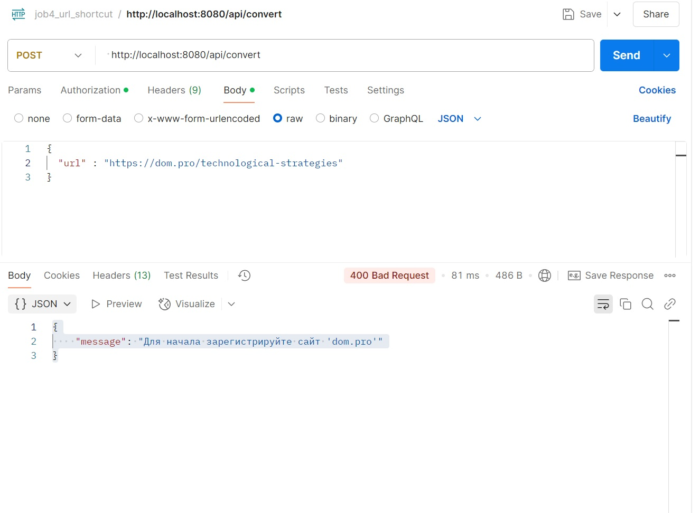
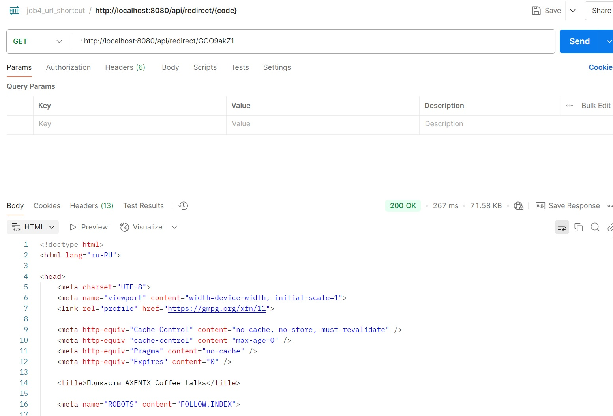
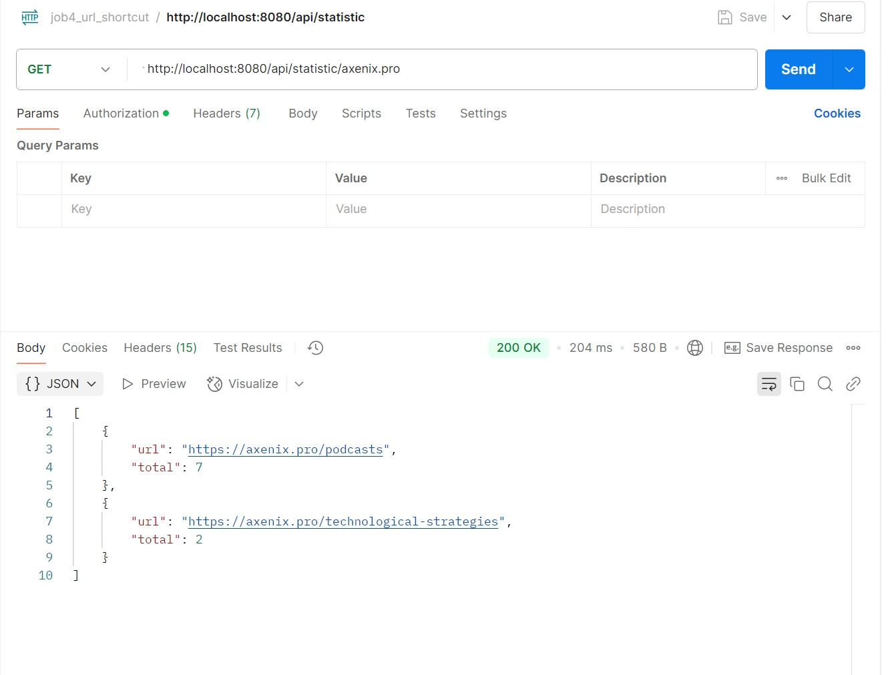

# Сервис безопасных ссылок

### О проекте

Проект реализует функционал для обеспечения безопасности пользователей с помощью замены всех ссылок на сайте ссылками
на сервис данного приложения.

"Сервис безопасных ссылок" является Spring Boot приложением, использующим авторизацию (как базовую, так и авторизацию с
помощью токена),
и имеющий разные настройки доступа для выполнения rest-запросов.
Сервис предоставляет RESTful API для:

- регистрации сайта;
- авторизации;
- концертации исходной ссылки в безопасную;
- переход по бозопасной ссылке;
- статистику о количестве переходов по ссылкам конкретного сайта.

### Описание

1. Регистрация сайта

- Сервисом могут пользоваться разные сайты. Каждому сайту выдается пару пароль и логин.
- Чтобы зарегистрировать сайт в систему нужно отправить запрос.
- Пользователи могут войти в систему, предоставив правильные учетные данные.

2. Авторизация

- Пользователь отправляет POST запрос с login и password и получает ключ для выполнения некоторых rest_апросов с помощью
  авторизации
  сделать через JWT.

3. Регистрация URL

- После регистрации своего сайта пользователь может отправить ссылки на свой сайт и получать преобразованные
  ссылки.
- Для выполнения этой операции используется JWT-авторизация.

4. Переадресация

- Можно выполнять переадресацию по безлпасной ссылке.
- Выполняется без авторизации.

5. Статистика

- В сервисе считается количество вызовов каждого адреса.
- По сайту можно получить статистку всех адресов и количество вызовов этого адреса.
- Выполняется без авторизации.

### Технологии и инструменты

Java 17, Spring Boot 3, JWT, Bootstrap, Liquibase 4, Sql2o 1, PostgreSQL 42, Hibernate 2, MapStruct 1.5.5.Final,
Spring Security, Swagger

### Требования к окружению

SpringBoot 3.4.3, Java 17, Maven 3.4.0, PostgreSQL 42

### Запуск проекта

``` create database cinema;  ```
``` mvn clean install  ```
и далее запускаем приложение

В проекте есть возможность выполнения многоэтапной сборки и запуска:
1. Сборка:
docker-compose build
2. Запуск:
docker-compose up -d

### Взаимодействие с приложением

#### Скриншоты

##### *Сваггер*
/swagger-ui/index.html



##### *Регистрация сайта сайта*



##### *Регистрация сайта - ошибка*



##### *Авторизация*



##### *Авторизация - ошибка*



##### *Преобразование исходной ссылки в безопасную*



##### *Преобразование исходной ссылки в безопасную - ошибка: неавторизованный пользователь*



##### *Преобразование исходной ссылки в безопасную - ошибка: сайт не зарегистрирован*



##### *[Переход по безопасной ссылке*



##### *Статистика количества переходов по ссылкам сайта*



#### API

|          |                                        |                                                                       |
|----------|----------------------------------------|-----------------------------------------------------------------------|
| POST     | /api/registration                      | Регистрация сайта                                                     |
| POST     | /api/signin                            | Авторизация                                                           |
| POST     | /api/convert                           | Регистрация ссылки сайт и получение преобразованной ссылки            |
| CET      | /api/redirect/{code}                   | Переход по безопасной ссылке                                          |
| CET      | /api/statistic/{siteName}              | Статистика количества переходов по ссылкам сайта                      |
| -------- | -------------------------------------- | --------------------------------------------------------------------- |

### Контакты


- Telegram: [@OlgaIlyina0312](https://t.me/OlgaIlyina0312)
- Email:    [oliljina@mail.ru](oliljina@mail.ru)
